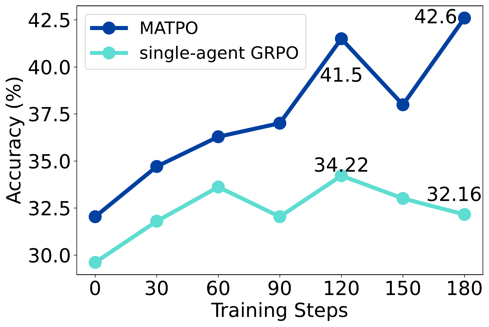
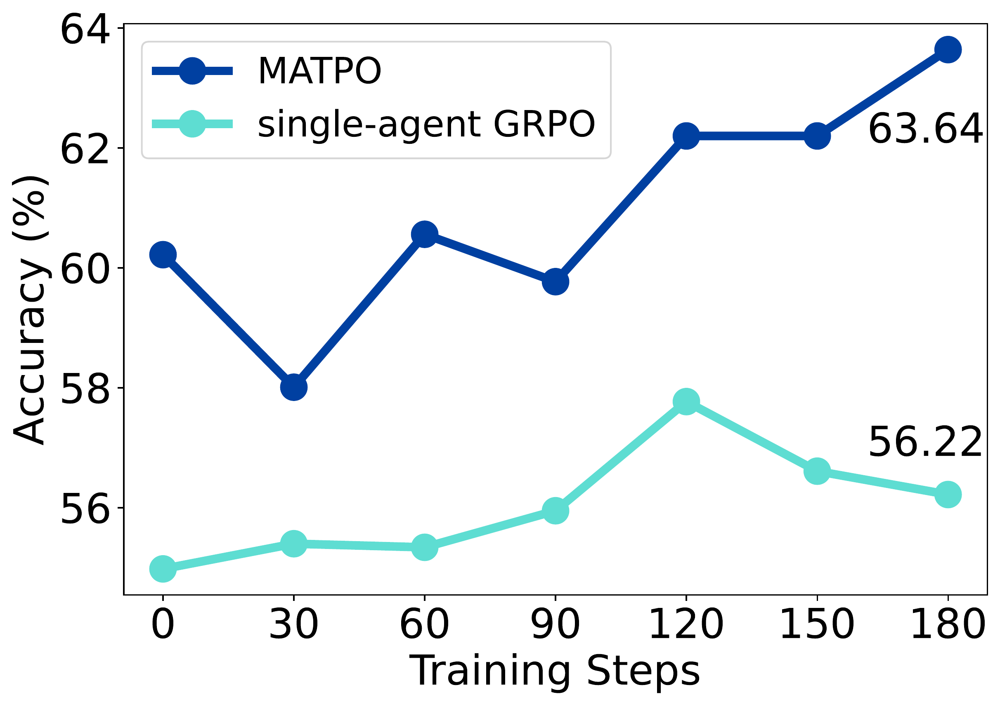
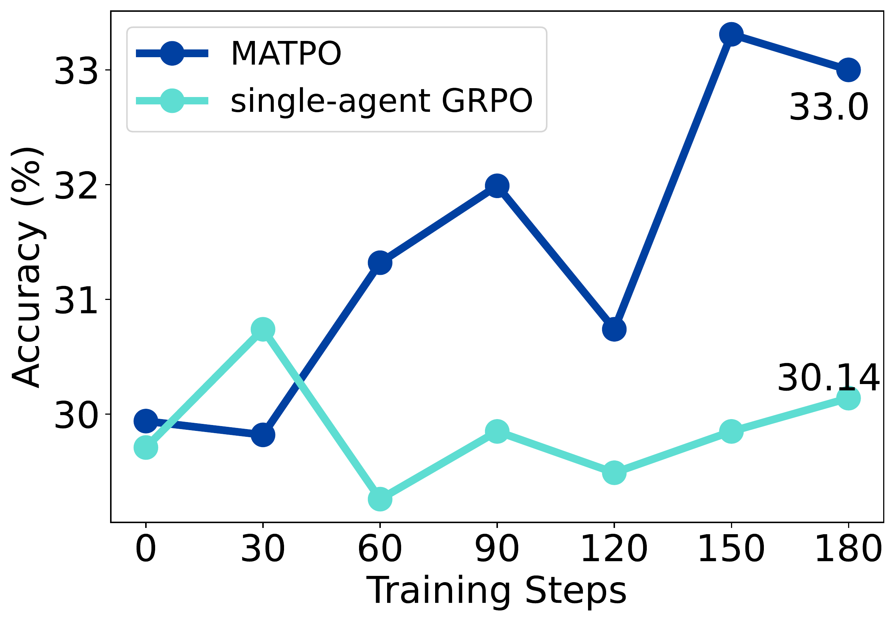
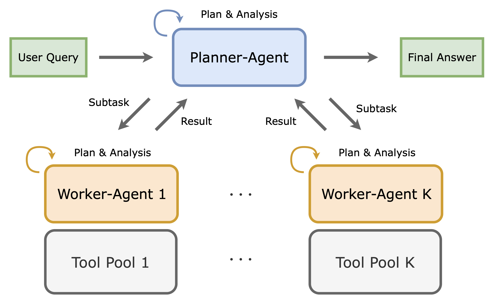
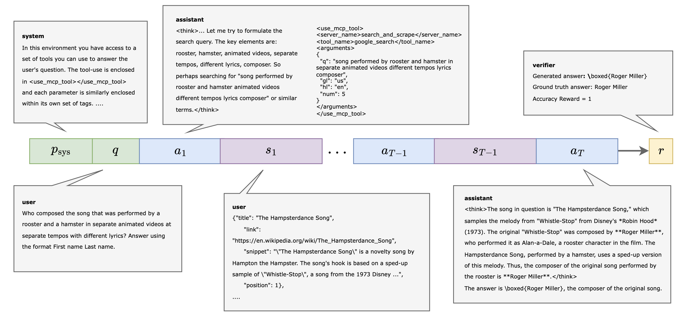
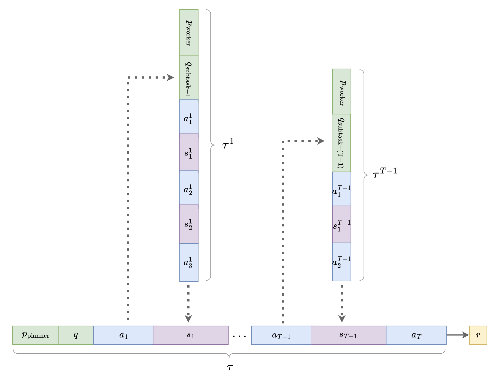
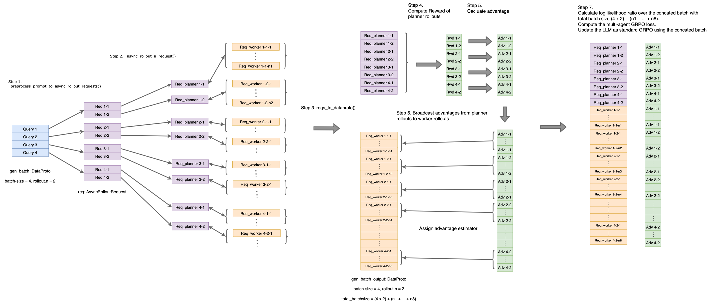

<div align="center">

# MATPO: Multi-Agent Tool-Integrated Policy Optimization

Train Multiple Agent Roles Within a Single LLM via Reinforcement Learning.

<!-- [](https://arxiv.org/pdf/2510.04678)
[](LICENSE)
[](https://www.python.org/downloads/)
[](https://github.com/mzf666/MATPO) -->

<!-- <hr> -->
<div align="center">

[](https://huggingface.co/veggiebird/MATPO-14b)
[](https://huggingface.co/datasets/veggiebird/MATPO-data)
[](https://arxiv.org/abs/2510.04678)
[](https://github.com/mzf666/MATPO)
</div>


</div>

<div align="center">
  <table>
    <tr>
      <td align="center">
        <br>
        <em>GAIA Results</em>
      </td>
      <td align="center">
        <br>
        <em>FRAMES Results</em>
      </td>
      <td align="center">
        <br>
        <em>WebWalkerQA Results</em>
      </td>
    </tr>
  </table>
</div>

<p align="center">
  
</p>


<p align="center">
  <em>MATPO allows planner and worker agents to coexist within a single LLM and be trained via RL, achieving an 18.38% relative improvement over single-agent baselines on GAIA-text, FRAMES, and WebWalker-QA.</em>
</p>

## News & Updates

- **[2025-Oct-31]** Quick start guide with PyTorch basic docker image released
- **[2025-Oct-08]** MATPO-Qwen3-14B checkpoints and rollouts released
- **[2025-Oct-08]** Code and training scripts released
- **[2025-Oct-06]** Arxiv Paper released


## Overview

**MATPO** (Multi-Agent Tool-Integrated Policy Optimization) is a novel reinforcement learning framework that enables training multiple specialized agent roles (planner and worker agents) within a single large language model. 

### The Problem
Current single-agent approaches for multi-turn tool-integrated planning face critical limitations:
- **Context Length Bottleneck**: Tool responses (e.g., web scraping) consume excessive tokens, making long-range planning prohibitive
- **Noisy Tool Responses**: Raw tool responses interfere with the model's attention and planning capabilities

### Our Solution
MATPO introduces a **multi-agent-in-one-model** architecture where:
- A **planner-agent** orchestrates high-level planning and delegates subtasks
- **Worker-agents** handle specific browsing and search tasks with isolated contexts
- Both roles are trained within a **single LLM** using role-specific prompts via reinforcement learning


## Key Features

- **Multi-Agent-in-One-Model**: Train planner and worker agents within a single LLM using role-specific system prompts
- **Principled Credit Assignment**: Extends GRPO with theoretically grounded reward distribution across planner and worker rollouts
- **Easy Integration**: Built on top of [veRL](https://github.com/volcengine/verl), compatible with existing RL training frameworks
- **Robust Training**: More stable learning curves compared to single-agent approaches, especially with noisy tool responses
- **Infrastructure Efficient**: No need for deployment of separate models or additional rollout engines


## MATPO Architecture

MATPO employs a hierarchical multi-agent framework where a single LLM serves multiple roles:

```
User Query → Planner Agent → Subtask 1 → Worker Agent → Result 1
                           → Subtask 2 → Worker Agent → Result 2
                           → ...
                           → Final Answer
```


<p align="center">
  
  
</p>

<p align="center">
  <em>Comparison between the rollout trajectories between the single-agent GRPO (top) and the multi-agent MATPO (bottom).</em>
</p>


### Multi-Agent Rollout Process

1. **Planner Agent**: 
   - Receives user query with planner-specific system prompt
   - Generates high-level plan and decomposes it into subtasks
   - Delegates subtasks to worker agents
   - Synthesizes worker responses into final answer

2. **Worker Agent**:
   - Receives subtask with worker-specific system prompt
   - Performs multi-turn tool-integrated planning (search, scrape, analyze)
   - Returns summarized result to planner
   - Maintains isolated context to prevent token overflow

3. **Credit Assignment**:
   - Final answer accuracy determines the reward
   - Reward is normalized across all planner-worker rollout groups
   - Gradient flows to both planner actions and worker actions proportionally

 
<p align="center">
  
</p>

<p align="center">
  <em>Visualization of MATPO implementation.</em>
</p>


## Quick Start

This section provide a quick start guide from PyTorch basic docker image.

Prerequisites:
- You can train a Qwen3-4B model with 1 x (8 x 80G-A800) NVIDIA A800 80GB GPUs. 
- NVIDIA Driver.
- Docker with the [NVIDIA Container Toolkit](https://docs.nvidia.com/datacenter/cloud-native/container-toolkit/latest/install-guide.html).

**Step 1**: Clone the repository.
```bash
cd YOUR_WORKING_DIR
git clone https://github.com/mzf666/MATPO.git
cd MATPO
```

**Step 2**: Download the training and testing datasets to the `data` directory. The prerpocessed datasets can be downloaded [here](https://huggingface.co/datasets/veggiebird/MATPO-data).

**Step 3**: Launch the PyTorch docker container. Make sure the mounted directories are writable.
```bash
docker pull pytorch/pytorch:2.6.0-cuda12.4-cudnn9-devel
docker run -it \
    --gpus all \
    --shm-size 16gb \
    --name matpo \
    -v YOUR_WORKING_DIR/MATPO:/workspace/MATPO:rw \
    -v YOUR_WORKING_DIR/models:/workspace/models \
    -w /workspace/MATPO \
    pytorch/pytorch:2.6.0-cuda12.4-cudnn9-devel \
    /bin/bash
```
Now you are in the PyTorch docker container.

**Step 4**:  Start to install the python dependencies inside the docker container.
```bash
# Execute the following commands inside the docker container

# Create a new conda environment for MATPO
conda create -n matpo python==3.10 -y
conda init bash
source /opt/conda/etc/profile.d/conda.sh
conda activate matpo

# Install the python dependencies
# You are highy recommended to execute the commands in the install.sh script one by one.
source /workspace/MATPO/examples/sglang_multiturn/install.sh
```

**Step 5**: Setup Node.js for Serper API support inside the docker container. 
> MCP (Model Context Protocol) requires Node.js to run MCP servers. Node.js version 18+ is recommended for optimal compatibility with MCP tools. Configure the Node.js paths and HTTP / HTTPS proxies (if necessary) in the `examples/sglang_multiturn/run_in_docker/launch.sh` script properly.
```bash
# Install Node.js
apt-get update && apt-get install -y wget xz-utils git
cd /workspace
wget https://nodejs.org/dist/v24.2.0/node-v24.2.0-linux-x64.tar.xz
cd -

NODEJS_HOME=/workspace/nodejs
mkdir -p $NODEJS_HOME
tar -xf /workspace/node-v24.2.0-linux-x64.tar.xz -C $NODEJS_HOME

# Configure Node.js environment variables
export PATH=$NODEJS_HOME/bin:$PATH
export NODE_SHARED=$NODEJS_HOME/node-shared/node_modules
export PATH=$NODE_SHARED/.bin:$PATH

# Verify Node.js installation
node --version
npm --version

# Install Serper MCP Server
mkdir -p $target_path/node-shared
cd $target_path/node-shared
npm init -y
npm install serper-search-scrape-mcp-server

# Back to MATPO repository
cd /workspace/MATPO 
```

**Step 6**: Test the environment setup and run single-node training. Train a Qwen3-4B model with MATPO on the MuSiQue dataset and evaluate on the GAIA-text datasets. 

Remember to adjust the directory paths in `examples/sglang_multiturn/launch.sh` accordingly, e.g. `YOUR_NODEJS_HOME=/workspace/nodejs/node-v24.2.0-linux-x64` and `YOUR_NODE_SHARED=/workspace/nodejs/node-shared/node_modules`.

```bash
# Execute the following commands inside the docker container
# Tested on 1 x (8 x 80G-A800) nodes

#!/bin/bash
source /opt/conda/etc/profile.d/conda.sh
export SERPER_API_KEY="YOUR_SERPER_API_KEY"
export OPENAI_API_KEY="YOUR_OPENAI_API_KEY"
export WANDB_API_KEY="YOUR_WANDB_API_KEY"
export SINGLENODE=true
export RAY_DEBUG=legacy
export HYDRA_FULL_ERROR=1
conda activate matpo
cd /workspace/MATPO
bash ./examples/sglang_multiturn/launch.sh \
    examples/sglang_multiturn/qwen3-4b_musique_single_agent.sh

# bash ./examples/sglang_multiturn/run_in_docker/launch.sh ./examples/sglang_multiturn/run_in_docker/qwen3-4b_musique_single_agent.sh
```

If you counter any issues during the environment setup, you can refer to the `examples/sglang_multiturn/pip_list_reference.txt` for the expected python dependencies list and check the installation process step by step.

**Step 7**: Train a Qwen3-14B model with MATPO on the MuSiQue dataset and evaluate on the GAIA-text datasets using computation platforms with multiple GPU nodes. Remember to adjust the directory paths in `examples/sglang_multiturn/launch.sh` accordingly. 

```bash
# tested on 16 x (8 x 80G-A800) nodes

export SERPER_API_KEY="YOUR_SERPER_API_KEY" && \
export OPENAI_API_KEY="YOUR_OPENAI_API_KEY" && \
export WANDB_API_KEY="YOUR_WANDB_API_KEY" && \
export SINGLENODE=true && \
export RAY_DEBUG=legacy && \
export HYDRA_FULL_ERROR=1 && \
source YOUR_CONDA_PATH activate matpo && \
cd YOUR_PROJECT_PATH && \
bash examples/sglang_multiturn/launch.sh \
    examples/sglang_multiturn/qwen3-14b_musique_MATPO.sh
```

Evaluate a trained MATPO / single-agent model checkpoint.
```bash
# test on 2 x (8 x 80G-A800) nodes

export SERPER_API_KEY="YOUR_SERPER_API_KEY" && \
export OPENAI_API_KEY="YOUR_OPENAI_API_KEY" && \
export WANDB_API_KEY="YOUR_WANDB_API_KEY" && \
export SINGLENODE=true && \
export RAY_DEBUG=legacy && \
export HYDRA_FULL_ERROR=1 && \
source YOUR_CONDA_PATH activate matpo && \
cd YOUR_PROJECT_PATH && \
bash examples/sglang_multiturn/launch.sh \
    examples/sglang_multiturn/eval_MATPO.sh

# # To evaluate a trained single-agent GRPO model checkpoint:
# bash examples/sglang_multiturn/launch.sh \
#     examples/sglang_multiturn/eval_single_agent.sh
```

## Experiments and Results

### Main Results

MATPO consistently outperforms single-agent GRPO baselines across all benchmarks:

| Method | GAIA-text | WebWalkerQA | FRAMES | Relative Average Improvement |
|--------|-----------|-------------|---------|---------------------|
| Single-Agent GRPO | 32.16% | 30.14% | 56.22% | - |
| **MATPO (Ours)** | **42.60%** | **33.00%** | **63.64%** | **+18.38%** |

### Training Configuration

- **Base Model**: Qwen3-14B-base
- **Training Dataset**: Filtered MuSiQue dataset.
- **Training Steps**: 180 steps
- **Rollouts per Query**: 8 (for group normalization)
- **Reward Function**: 0.9 × accuracy + 0.1 × tool_format_reward

### Model Checkpoints and Rollouts


We release the trained Qwen3-14B-base model checkpoints at the 180th training step of both [single-agent GRPO](https://huggingface.co/veggiebird/MATPO-single-agent-14b) and [MATPO](https://huggingface.co/veggiebird/MATPO-14b).

The associated model rollouts across various training steps can be found [here](https://huggingface.co/datasets/veggiebird/MATPO-rollout).


### Key Findings

- **More Stable Training**: MATPO exhibits more stable learning curves and avoids catastrophic performance drops observed in single-agent training

- **Robustness to Noise**: Multi-agent decomposition effectively isolates noisy tool responses, preventing them from interfering with high-level planning

- **Better Credit Assignment**: Principled reward distribution across planner and worker rollouts leads to more effective learning


### Practical Implementation Tips

Based on our experiments, we recommend:

- **Final Summary**: Final summaries from worker agents are critical for clean planner-worker interfaces
- **Query Recap**: Recapping original user query in worker prompt significantly improves performance
- **URL Blocking**: Remember to blocking HuggingFace search results to avoid data leakage


## Adding New Tools and Worker-Agents

To add new tools or worker-agents, you need to:

1. **Update the agent-tool configuration file**: modify the `examples/sglang_multiturn/config/tool_config/mcp_tool_config_full_agent.yaml` agent-tool configuration file following the instructions in the following subsections. 
2. **Update the system prompt of your training data**: update the system prompt of your training data accordingly, to ensure the planner-agent recieve the instructions to call new tools or new worker-agents correctly. A script to establish training data with updated system prompts based on a new agent-tool configuration file is provided in `examples/data_preprocess/update_system_prompt.py`.

In the following subsections, we present some examples on how to add new tools or worker-agents by modifying the agent-tool configuration file.

### Adding New MCP Tools to the Planner-Agent
You can add a new MCP tool to the planner-agent by adding a new entry to the `tools` list. Before adding the new tool, you need to wrap up your tool server into a standard MCP server. A tutorial on how to building new MCP tools is provided [here](https://miromindai.github.io/MiroFlow/contribute_tools/). 

In this example, we add a new MCP tool for calling a Python interpreter.

```yaml
tools:
  - class_name: "verl.tools.mcp_tool.MCPTool"
    config:
      command: "serper-mcp"
      args: []
      env: ["SERPER_API_KEY", "HTTPS_PROXY"]
      server_name: "search_and_scrape_webpage"
    tool_schema:
      type: "mcp"
      function: {}

  # A newly added Python interpreter MCP tool.
  - class_name: "verl.tools.mcp_tool.MCPTool"
    config:
      command: "python3"
      args: ["verl/tools/python_server.py"]
      env: ["E2B_API_KEY", "HTTPS_PROXY"]
      server_name: "python_interpreter"
    tool_schema:
      type: "mcp"
      function: {}

  - class_name: "verl.tools.mcp_tool.MCPTool"
    config:
      command: ""
      server_name: "browsing_agent"
    tool_schema:
      type: "agent"
      function: {}
      schema:
        name: "search_and_browse"
        description: "This tool is an agent that performs the subtask of searching and browsing the web for specific missing information and generating the desired answer. The subtask should be clearly defined, include relevant background, and focus on factual gaps. It does not perform vague or speculative subtasks. \nArgs: \n\tsubtask: the subtask to be performed. \nReturns: \n\tthe result of the subtask."
        parameters:
          properties:
            subtask:
              title: "Subtask"
              type: "string"
          required:
            - "subtask"
          title: "search_and_browseArguments"
          type: "object"
        server_name: "browsing_agent"

agents:
  - agent_type: "main_agent"
    tools:
      - browsing_agent
      - python_interpreter # Now, the planner-agent can directly call a Python interpreter tool, or it can delegate a searching-and-browsing subtask to the browsing-agent.
  - agent_type: "browsing_agent"
    tools:
      - search_and_scrape_webpage
```

### Adding New Worker-Agents

You can define and add a new worker-agent by adding a new entry to the `tools` and `agents` list. In this example, we add a new worker-agent for tackling programming subtasks using a Python interpreter. 
```yaml
tools:
  - class_name: "verl.tools.mcp_tool.MCPTool"
    config:
      command: "serper-mcp"
      args: []
      env: ["SERPER_API_KEY", "HTTPS_PROXY"]
      server_name: "search_and_scrape_webpage"
    tool_schema:
      type: "mcp"
      function: {}

  # A newly added Python interpreter MCP tool.
  - class_name: "verl.tools.mcp_tool.MCPTool"
    config:
      command: "python3"
      args: ["verl/tools/python_server.py"]
      env: ["E2B_API_KEY", "HTTPS_PROXY"]
      server_name: "python_interpreter"
    tool_schema:
      type: "mcp"
      function: {}

  - class_name: "verl.tools.mcp_tool.MCPTool"
    config:
      command: ""
      server_name: "browsing_agent"
    tool_schema:
      type: "agent"
      function: {}
      schema:
        name: "search_and_browse"
        description: "This tool is an agent that performs the subtask of searching and browsing the web for specific missing information and generating the desired answer. The subtask should be clearly defined, include relevant background, and focus on factual gaps. It does not perform vague or speculative subtasks. \nArgs: \n\tsubtask: the subtask to be performed. \nReturns: \n\tthe result of the subtask."
        parameters:
          properties:
            subtask:
              title: "Subtask"
              type: "string"
          required:
            - "subtask"
          title: "search_and_browseArguments"
          type: "object"
        server_name: "browsing_agent"

  # A newly added Python coding agent.
  - class_name: "verl.tools.mcp_tool.MCPTool"
    config:
      command: ""
      server_name: "python_agent"
    tool_schema:
      type: "agent"
      function: {}
      schema:
        name: "coding_in_python"
        description: "This tool is an agent that address subtasks that can be solved via Python programes. The subtask should be clearly defined, include relevant background, and focus on factual gaps. It does not perform vague or speculative subtasks. \nArgs: \n\tsubtask: the subtask to be performed. \nReturns: \n\tthe result of the subtask."
        parameters:
          properties:
            subtask:
              title: "Subtask"
              type: "string"
          required:
            - "subtask"
          title: "coding_in_pythonArguments"
          type: "object"
        server_name: "python_agent"

agents:
  - agent_type: "main_agent"
    tools:
      - browsing_agent
      - python_agent # The main-agent can delegate a coding subtask to the python-agent.

  - agent_type: "browsing_agent"
    tools:
      - search_and_scrape_webpage

  # A newly added Python coding agent.
  - agent_type: "python_agent"
    tools:
      - python_interpreter # The python-agent can directly call a Python interpreter tool to solve the coding subtask from the main-agent.
```

### Customizing Your Rollout Orchestration

In this repository, the multi-agent rollout orchestration is implemented the `_async_rollout_a_request()` function in `verl/workers/rollout/sglang_rollout/sglang_rollout.py`. The workflow is sketched as follows:

1. At each intermediate step in planner-agent rollout:
  - Once a MCP tool-call is parsed from the LLM response, the `_async_rollout_a_request()` function will be called to determine which agent to call, and return the MCP tool-call response. 
  - Once a worker-agent-call is parsed from the LLM response, the `_async_rollout_a_request()` function will create a new `AsyncRolloutRequest` object for this worker-agent-call, and pass it to `_async_rollout_a_request()` again to trigger a new agentic rollout. 
2. After the planner-agent rollout terminates (either no further tool-calls are parsed), all the worker-agent rollouts will be collected, serialized, and packed with the planner-agent rollout. 
3. The packed rollout will be passed to `verl/trainer/ppo/ray_trainer.py` to proceed MATPO training.

You can customize your own rollout orchestration by modifying the logic and scheduling in the `_async_rollout_a_request()` function.

## Citation

If you find MATPO helpful in your research, please consider citing our paper:

```bibtex
@misc{mo2025multiagenttoolintegratedpolicyoptimization,
      title={Multi-Agent Tool-Integrated Policy Optimization}, 
      author={Zhanfeng Mo and Xingxuan Li and Yuntao Chen and Lidong Bing},
      year={2025},
      eprint={2510.04678},
      archivePrefix={arXiv},
      primaryClass={cs.CL},
      url={https://arxiv.org/abs/2510.04678}, 
}
```


## Acknowledgments

We would like to thank:

- **VolcEngine** for developing and open-sourcing [veRL](https://github.com/volcengine/verl), the RL training framework that powers MATPO
- **Alibaba Cloud** for the Qwen3 model series
- **Google** for the Serper API that enables web search capabilities
- The authors of **GAIA**, **WebWalkerQA**, **FRAMES**, and **MuSiQue** datasets
- The open-source community for valuable feedback and contributions


## FAQ

<details>
<summary><b>Q: What's the difference between MATPO and traditional multi-agent systems?</b></summary>

MATPO uses a single LLM to play multiple agent roles via different system prompts, rather than deploying separate models. This offers:
- Lower infrastructure complexity
- Better parameter efficiency
- Easier deployment and maintenance
- Compatible with existing RL frameworks
</details>

<details>
<summary><b>Q: Can I use MATPO with models other than Qwen3?</b></summary>

Yes! MATPO is model-agnostic. You can use any decoder-only LLM that supports tool calling and multi-turn conversations. We've tested with Qwen3-14B-base, but models like Llama 3, Mistral, or other reasoning-capable LLMs should work.
</details>

<details>
<summary><b>Q: How many GPUs do I need for training?</b></summary>

For Qwen3-14B-base, we recommend:
- **Training**: 16 x (8 x A100/A800 GPUs (80GB))
- **Inference**: 2 x (8 x A100/A800 GPUs (80GB))

</details>

<details>
<summary><b>Q: How does MATPO handle credit assignment?</b></summary>

MATPO extends GRPO with principled credit assignment:
1. The planner's final answer determines the accuracy reward
2. This reward is normalized across all rollouts in a group
3. Gradients flow proportionally to both planner and worker actions
4. Worker agents receive the same advantage value as their parent planner rollout

See our paper for more details.
</details>

<details>
<summary><b>Q: Can I use MATPO for tasks other than web search?</b></summary>

Absolutely! While our paper focuses on web search, MATPO's framework is general. You can extend it to:
- Code generation with execution feedback
- Scientific reasoning with calculator tools
- Data analysis with pandas/SQL tools
- Any multi-turn task with verifiable rewards
</details>

<details>
<summary><b>Q: How stable is MATPO training compared to single-agent RL?</b></summary>

MATPO is significantly more stable. Our experiments show:
- Single-agent GRPO often suffers catastrophic drops after step 120
- MATPO maintains steady improvement throughout training
- Multi-agent structure isolates noisy tool responses, preventing interference

See Figure 4 in our paper for training curves.
</details>

<details>
<summary><b>Q: Do I need to block HuggingFace URLs during training?</b></summary>

For research integrity, yes - especially if your evaluation benchmarks are hosted on HuggingFace. This prevents models from "cheating" by finding ground-truth answers online. 

For production systems with no data leakage concerns, this is optional.
</details>

## Star History

<a href="https://star-history.com/#mzf666/MATPO&Date">
 <picture>
   <source media="(prefers-color-scheme: dark)" srcset="https://api.star-history.com/svg?repos=mzf666/MATPO&type=Date&theme=dark" />
   <source media="(prefers-color-scheme: light)" srcset="https://api.star-history.com/svg?repos=mzf666/MATPO&type=Date" />
   
 </picture>
</a>

-----

<p align="center">
  <strong>Star ⭐ this repository if you find it helpful!</strong>
</p>
